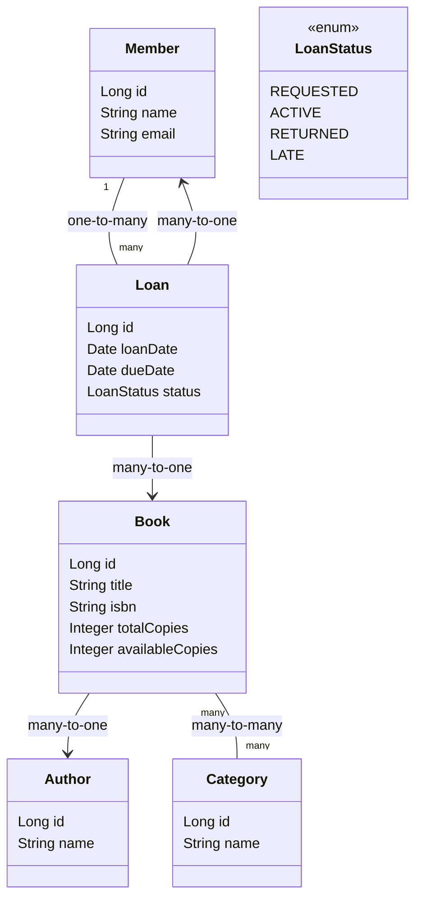

# Library Management API

API REST de gestion de bibliothèque (livres, auteurs, catégories, membres, emprunts) avec règles métier d’emprunt et retour, développée avec Spring Boot 4.0.

## 🎯 Objectif du Projet

Application complète de gestion d'une bibliothèque permettant de :
- Gérer un catalogue de livres avec leurs auteurs et catégories
- Gérer les membres de la bibliothèque
- Suivre les emprunts et retours de livres
- Appliquer des règles métier (limite d'emprunts, disponibilité des livres, etc.)

## 📋 Modèle de Données (5 Entités)

### Author (Auteur)
- Informations sur les auteurs des livres
- Relation **OneToMany** avec Book

### Category (Catégorie)
- Classification des livres par thème
- Relation **ManyToMany** avec Book

### Book (Livre)
- Catalogue des livres disponibles
- Relations : **ManyToOne** avec Author, **ManyToMany** avec Category, **OneToMany** avec Loan

### Member (Membre)
- Utilisateurs inscrits à la bibliothèque
- Relation **OneToMany** avec Loan

### Loan (Emprunt)
- Suivi des emprunts de livres
- Relations : **ManyToOne** avec Member et Book

## 🚀 Démarrage du Projet

### Prérequis
- Java 21
- Maven 3.8+
- Docker (PostgreSQL via `docker-compose.yml`)

### 1. Démarrer la base de données

```powershell
docker compose -f ".\docker-compose.yml" up -d
```

Vérifier que PostgreSQL est démarré :
```powershell
docker ps
```

### 2. Lancer l'application

Avec Maven Wrapper (Windows PowerShell) :
```powershell
\.\mvnw.cmd spring-boot:run
```

Avec Maven Wrapper (Linux/macOS) :
```bash
./mvnw spring-boot:run
```

L'API sera accessible sur : `http://localhost:8080`

Démarrage via JAR (optionnel) :
```powershell
mvn clean package
java -jar ".\target\library-management-api-0.0.1-SNAPSHOT.jar"
```

### 3. Vérifier la connexion

Au démarrage, vérifiez dans les logs que :
- La connexion à PostgreSQL est établie
- Les tables sont créées automatiquement (grâce à `ddl-auto: update`)
- Aucune erreur n'apparaît

## 🏗️ Architecture

```
src/main/java/be/condorcet/library/
├── config/          # Configuration (Security, etc.)
├── controller/      # Contrôleurs REST
├── dto/             # Data Transfer Objects
├── exception/       # Gestion des erreurs
├── model/           # Entités JPA
│   └── enums/       # Énumérations (LoanStatus)
├── repository/      # Repositories Spring Data JPA
└── service/         # Services (logique métier)
```

## 🔐 Sécurité

- HTTP Basic activé.
- GET : public.
- POST/PUT/DELETE : rôle `ADMIN` requis.
- Utilisateurs en mémoire (exemple typique) : `user/user`, `admin/admin`.

Exemple d’appel avec Basic Auth (PowerShell) :
```powershell
$cred = [System.Convert]::ToBase64String([System.Text.Encoding]::ASCII.GetBytes("admin:admin"))
$headers = @{ Authorization = "Basic $cred"; "Content-Type"="application/json" }
Invoke-RestMethod -Uri "http://localhost:8080/api/authors" -Method Post -Headers $headers -Body '{ "name":"Isaac Asimov" }'
```

## 📚 Documentation API

La collection Postman se trouve à la racine : `library-api.postman_collection.json` (variables `{{base_url}}`).

## 📦 Technologies Utilisées

- **Spring Boot 4.0.0**
- **Spring Data JPA** (Hibernate)
- **Spring Security**
- **PostgreSQL 18.1**
- **Jakarta Validation**
- **Docker** (pour la base de données)

## 🧩 Diagramme de Classes (Mermaid)



## ✅ Fonctionnalités Principales

- CRUD complet sur `Author`, `Category`, `Member`, `Book`, `Loan`.
- Recherche et filtrage de livres (disponibilités, catégories, auteur).
- Règles d’emprunt :
  - Empêcher l’emprunt si `availableCopies == 0`.
  - Limiter les emprunts actifs par membre (ex. 3).
  - Création d’emprunt : décrémente `availableCopies`.
  - Retour : incrémente `availableCopies`, statut `RETURNED`.
  - Retard : statut `LATE` si `dueDate` dépassée.

## 👨‍💻 Auteur

Projet réalisé dans le cadre du cours de Programmation Avancée - BAC3 Informatique
